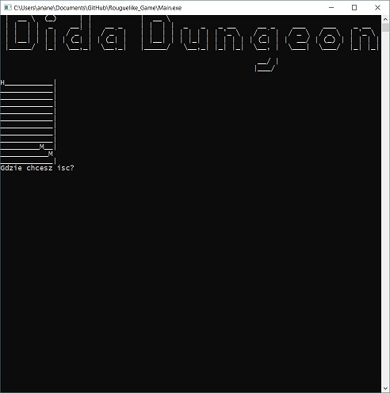
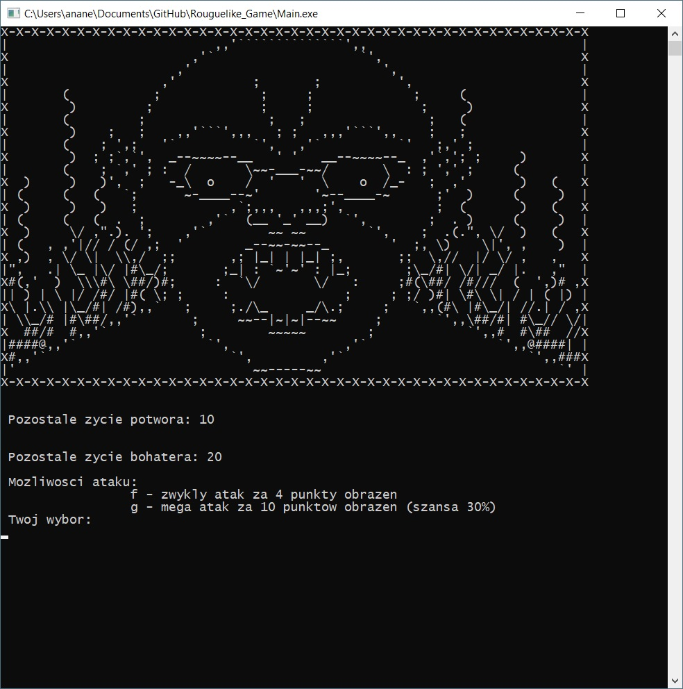

# Rougelike_Game "Dida Dungeon"

After starting the game, two console windows appear on the screen, on one "the map" is drawn, and the description of events on the other.
The map is composed of room type () objects, they can be open or closed, it will be generated randomly, with the option of moving through the map to the next level. If the generated map will not be able to pass, it will be rejected by the checking algorithm and a new map will be generated. The player starts from the top left corner and ends at the bottom right. Move the hero by pressing the keys W, S, A, D
Map display prototype (without selected rooms)

 
 
Open rooms may contain treasure chests: weapons, armor.
These treasures have a good prefix (positive effect) or bad (negative effect), which affects the number of life points or the strength of the attack. Presentation and description of things that "fall out" from the chests will appear in the console next to it. The hero will have a "backpack" with limited capacity - the player will have to decide when the backpack is full,
about stopping / removing things from the backpack and replacing them with items from the room. Items that have not been removed from the treasure chest are lost.
The map also moves enemies whose hero must overcome using artifacts found along the way. The fight comes when the hero and the enemy are in the same open room. The number of enemies is random and scaled to the appropriate level of the map on which the player is located. Enemies move randomly relative to the hero's position.
The goal of the game is to reach the highest level of the "dungeon".

